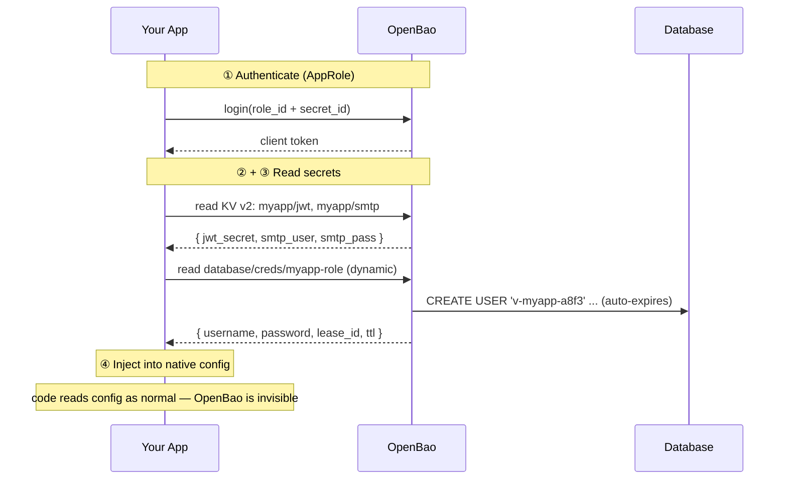

# OpenBao Secrets Guide

> A practical guide to wiring **application secrets** through [OpenBao](https://openbao.org) — the open-source, community-run fork of HashiCorp Vault — in **.NET**.

Most apps keep their JWT signing key, SMTP password, and database credentials in a `.env` file or environment variables. That works — until the credential leaks, until you need to rotate it, until an auditor asks "how often do these change?" This guide shows how to move those secrets into OpenBao so they're **centralized, access-controlled, versioned, and (optionally) short-lived and auto-rotating**.

---

## The one pattern you actually need to learn

The integration is the same four steps every time.



1. **Authenticate** — the app logs in with an **AppRole** (`role_id` + `secret_id`). `secret_id` is the one irreducible "secret zero."
2. **Read static secrets** — fetch values from the **KV v2** store (JWT key, SMTP creds, etc.).
3. **Read dynamic secrets** *(advanced)* — ask the **database engine** to mint a fresh, short-lived DB user that auto-expires.
4. **Inject into native config** — drop the values into wherever your app already reads config (.NET's `IConfiguration`, via a custom provider). The rest of your app never knows OpenBao exists.

That isolation — OpenBao only swaps the *source* of config — is what makes this a drop-in retrofit.

---

## The .NET recipe

| Framework | Client library | Native config home | Recipe |
|---|---|---|---|
| **.NET** | VaultSharp | `IConfiguration` (custom provider) | [recipes/dotnet.md](recipes/dotnet.md) |

The recipe covers the same four tasks: **AppRole login · read a KV secret · inject into config · (advanced) dynamic DB credentials.**

---

## Learn it properly

The recipe is copy-paste. The `docs/` walk through the *why*:

1. **[The Pattern](docs/01-the-pattern.md)** — the universal flow, AppRole, and why secrets stay behind your config layer.
2. **[Static Secrets (KV v2)](docs/02-static-secrets-kv.md)** — storing and reading JWT keys, SMTP creds, connection strings. The `/data/` quirk. Read-once-at-boot and what rotation means.
3. **[Dynamic Database Credentials](docs/03-dynamic-db-creds.md)** — the advanced flex: per-request DB users, leases, renewal, and the connection-pool wrinkle.
4. **[Bootstrap, AppRole & "Secret Zero"](docs/04-bootstrap-approle.md)** — provisioning OpenBao reproducibly: engines, policies, the AppRole, and the one secret you can't escape.
5. **[Dev vs Prod](docs/05-dev-vs-prod-sealing.md)** — dev-mode containers vs production Raft storage, sealing/unsealing, and the anti-patterns to avoid.

---

## Quick start (local, 2 minutes)

```bash
# 1. Run OpenBao in dev-mode (in-memory, auto-unsealed — local only)
docker run --cap-add=IPC_LOCK \
  -e BAO_DEV_ROOT_TOKEN_ID=dev-root-token \
  -p 8200:8200 --name openbao openbao/openbao:latest \
  server -dev -dev-listen-address=0.0.0.0:8200

# 2. Provision engines, secrets, policy, and an AppRole (idempotent)
JWT_SECRET=$(openssl rand -hex 32) \
  ./scripts/openbao-bootstrap.sh

# 3. The script prints a role_id and secret_id — feed those to your app.
```

Then open the [.NET recipe](recipes/dotnet.md) and wire it up. Browse what you seeded at **http://127.0.0.1:8200/ui** (token: `dev-root-token`).

> ⚠️ Dev-mode stores everything **in memory** — `docker rm` wipes it. That's intentional (it's disposable). Production uses persistent Raft storage and manual unsealing — see [docs/05](docs/05-dev-vs-prod-sealing.md).

---

## Static vs dynamic — which do you need?

**Static KV** is the 80%: your secrets live in OpenBao instead of a `.env`, centralized and access-controlled. Read once at boot; rotating means updating the value and restarting.

**Dynamic DB credentials** are the senior move: OpenBao *generates* a fresh database user per request, hands it to the app with a short lease, and `DROP`s it when the lease ends. A leaked credential is dead within the hour, automatically, with no app change.

Dynamic is worth the extra machinery when a leaked DB password is expensive to contain — compliance-mandated rotation, many services sharing a DB, broad operator access, high-value data. For a small single-operator app, **static KV is genuinely the right-sized choice** — don't cargo-cult the complexity. [docs/03](docs/03-dynamic-db-creds.md) covers when each pays off.

---

## License

MIT — see [LICENSE](LICENSE). Use it, fork it, teach from it.
